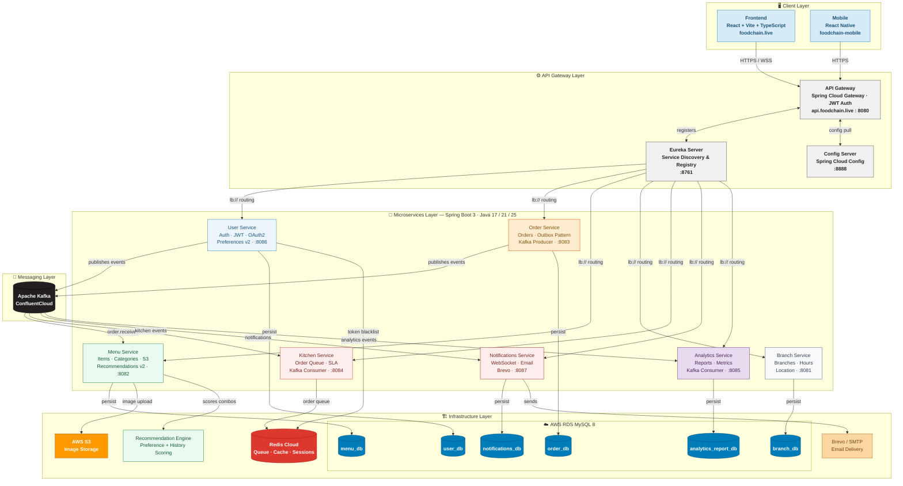
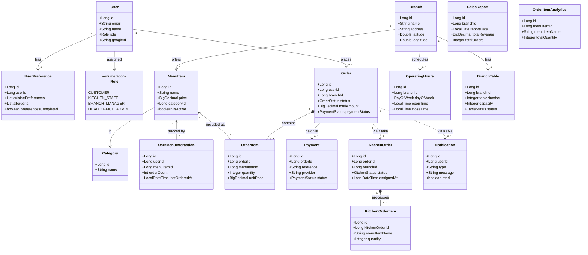
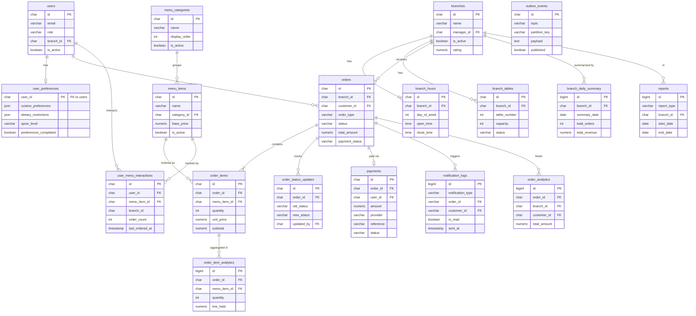

# FoodChain

A cloud-native restaurant management platform built across **10 microservices** — handling ordering, kitchen operations, menu management, branch coordination, analytics, and real-time notifications. Available on web and mobile (React Native).

All source code is maintained across multiple repositories under the **[FoodchainGroup08](https://github.com/FoodchainGroup08)** GitHub organisation.

---

## Architecture Overview

- **Pattern:** Microservices behind a single API Gateway entry point
- **Service Discovery:** Netflix Eureka — all services self-register and load-balance via `lb://`
- **Configuration:** Centralised via Spring Cloud Config Server pulling from a private GitHub repository
- **Messaging:** Event-driven via Apache Kafka — order lifecycle events flow between services asynchronously
- **Real-time:** WebSocket (STOMP) for live kitchen updates and customer order notifications
- **Deployment:** Docker containers across 2 AWS EC2 accounts, automated via GitHub Actions CI/CD

---

## Tech Stack

| Layer | Technology |
|---|---|
| Language | Java 17, 21, 25 |
| Framework | Spring Boot 3, Spring Cloud |
| Gateway | Spring Cloud Gateway |
| Service Discovery | Netflix Eureka |
| Database | MySQL 8.0 (AWS RDS) |
| Cache / Queue | Redis |
| Messaging | Apache Kafka |
| Frontend | React + Vite |
| Mobile | React Native |
| Containerisation | Docker + Docker Hub |
| CI/CD | GitHub Actions |
| Infrastructure | AWS EC2, RDS, S3 |

---

## Third-Party Services

| Service | Purpose |
|---|---|
| AWS EC2 × 2 (t3.medium) | Hosts all backend Docker containers |
| AWS RDS MySQL 8.0 | Persistent storage — 6 separate schemas on one instance |
| AWS S3 | Menu item image storage |
| Confluent Cloud | Managed Kafka broker (SASL_SSL) |
| Redis Cloud | Cache, sessions, and kitchen order queue |
| Google Gemini AI | Previously used for food suggestions — replaced by preference-based recommendation engine |
| Google Maps API | Branch location search and nearby branch discovery |
| Google OAuth2 | Social login for customer accounts |
| Brevo | Transactional email delivery |
| Namecheap | Domain registrar — foodchain.live |
| Cloudflare | Frontend hosting and DNS |
| Docker Hub | Container image registry |

---

## Repository Structure

| Repository | Function |
|---|---|
| [eureka-server](https://github.com/FoodchainGroup08/eureka-server) | Service registry — all services register and discover each other here |
| [config-server](https://github.com/FoodchainGroup08/config-server) | Spring Cloud Config Server — serves centralised config to all services |
| [foodchain-config](https://github.com/FoodchainGroup08/foodchain-config) | Centralised YAML config files pulled by config-server at runtime |
| [foodchain-deployment](https://github.com/FoodchainGroup08/foodchain-deployment) | Docker Compose files and GitHub Actions CI/CD workflows |
| [api-gateway](https://github.com/FoodchainGroup08/api-gateway) | Entry point — JWT auth, routing, CORS, WebSocket proxy |
| [user-service](https://github.com/FoodchainGroup08/user-service) | Authentication, Google OAuth2, user profiles and roles |
| [branch-service](https://github.com/FoodchainGroup08/branch-service) | Branch management, operating hours, and location |
| [menu-service](https://github.com/FoodchainGroup08/menu-service) | Menu items, categories, image uploads, and preference-based combo recommendations |
| [order-service](https://github.com/FoodchainGroup08/order-service) | Order placement, lifecycle management, and outbox events |
| [kitchen-service](https://github.com/FoodchainGroup08/kitchen-service) | Kitchen order queue and real-time status updates |
| [notifications-service](https://github.com/FoodchainGroup08/notifications-service) | WebSocket push notifications and transactional email alerts |
| [analytics-report-service](https://github.com/FoodchainGroup08/analytics-report-service) | Sales analytics, daily summaries, and report generation |
| [frontend](https://github.com/FoodchainGroup08/frontend) | React/Vite UI for customers and staff |
| [foodchain-mobile](https://github.com/FoodchainGroup08/foodchain-mobile) | React Native mobile app for customers and staff |

---

## Service Map

| Service | Port | URL |
|---|---|---|
| Frontend (Cloudflare) | — | [foodchain.live](https://foodchain.live) |
| API Gateway | 8080 | [api.foodchain.live](https://api.foodchain.live) |
| API Docs (Swagger) | — | [api.foodchain.live/webjars/swagger-ui/index.html](https://api.foodchain.live/webjars/swagger-ui/index.html) |
| User Service | 8086 | Internal |
| Branch Service | 8081 | Internal |
| Menu Service | 8082 | Internal |
| Order Service | 8083 | Internal |
| Kitchen Service | 8084 | Internal |
| Analytics Service | 8085 | Internal |
| Notifications Service | 8087 | Internal |
| Config Server | 8888 | Internal |
| Eureka Server | 8761 | Internal |

---

## Architecture Diagram

---

## Class Diagram

---

## Entity Relationship Diagram

---

## Key Improvements to Work On

- [ ] HTTPS termination for all internal services (gateway only for now)
- [ ] Circuit breakers with Resilience4j on critical inter-service calls
- [ ] Database schema migrations with Flyway
- [ ] Centralised structured logging (CloudWatch or ELK stack)
- [ ] Rate limiting at the API gateway level
- [ ] Expand test coverage — unit and integration tests per service
- [ ] Move from EC2 t2.micro to containerised orchestration (ECS or Kubernetes) for better resource management
- [ ] Multi-tenancy system — support multiple restaurant brands or franchise groups on one platform
